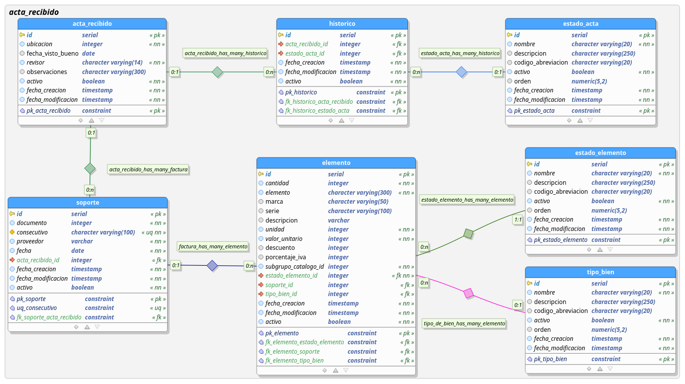

# Acta de Recibido ARKA II CRUD

acta_recibido_crud : API CRUD para el consumo de datos para el modulo de acta de recibido de la plataforma ARKA II, 
referente al modelo de negocio de inventarios de la Universidad Distrital. 
El proyecto está escrito en el lenguaje Go, generado mediante el **[framework beego](https://beego.me/)**.

## Modelo de Datos

### SQL del Modelo de datos: 

https://drive.google.com/open?id=1axnn6JPRVDLtPF9qunibtwKkFzn4M6oh

### Imagen del Modelo de Datos

https://drive.google.com/open?id=12zD-XDVDQ_iG9nFZM-vMbjOP_f47GVml

.


# Instalación
Para instalar el proyecto de debe relizar lo siguientes pasos:

## Opción 1

Ejecutar desde la terminal 'go get repositorio':
```shell 
go get github.com/udistrital/acta_recibido_crud.git
```

## Opción 2

1. Clonar en el proyecto en la carpeta local: go/src/github.com/udistrital:
```shell
cd ~go/src/github.com/udistrital 
```

2. Ejecutar:

```shell 
git clone https://github.com/udistrital/acta_recibido_crud.git
```

3. Ir a la carpeta del proyecto
```shell 
cd acta_de_recibido_crud
```

4. Instalar dependencias del proyecto:
```shell 
go get
```
# Variables de Entorno

Definir los valores de las siguientes variables de entorno:

 - `API_PRODUCCION_ACADEMICA_HTTP_PORT`: Puerto asignado para la ejecución del API
 - `PRODUCCION_ACADEMICA_CRUD__PGUSER`: Usuario de la base de datos
 - `PRODUCCION_ACADEMICA_CRUD__PGPASS`: Clave del usuario para la conexión a la base de datos  
 - `PRODUCCION_ACADEMICA_CRUD__PGURLS`: Host de conexión
 - `PRODUCCION_ACADEMICA_CRUD__PGDB`: Nombre de la base de datos
 - `PRODUCCION_ACADEMICA_CRUD__SCHEMA`: Esquema a utilizar en la base de datos

## Ejemplo: 
 - `API_PRODUCCION_ACADEMICA_HTTP_PORT`: 8080
 - `PRODUCCION_ACADEMICA_CRUD__PGUSER`: postgres
 - `PRODUCCION_ACADEMICA_CRUD__PGPASS`: postgres
 - `PRODUCCION_ACADEMICA_CRUD__PGURLS`: 127.0.0.1
 - `PRODUCCION_ACADEMICA_CRUD__PGDB`: arka
 - `PRODUCCION_ACADEMICA_CRUD__SCHEMA`: acta_recibido


# Ejecución del proyecto
Ubicado en la raíz del proyecto,
```shell 
cd ~/go/src/github.com/udistrital/acta_recibido_crud
```

- Ejecutar: 
```shell 
bee run
```
- O si se quiere ejecutar el swager:

```shell 
bee run -downdoc=true -gendoc=true
```

# Endpoint (la direccion depende de las variables de entorno)

## Ejemplo

* El servidor se expone en el puerto: 127.0.0.1:8080 

* Para ver la documentación de swagger: [127.0.0.1:8080/swagger/](http://127.0.0.1:8080/swagger/)
